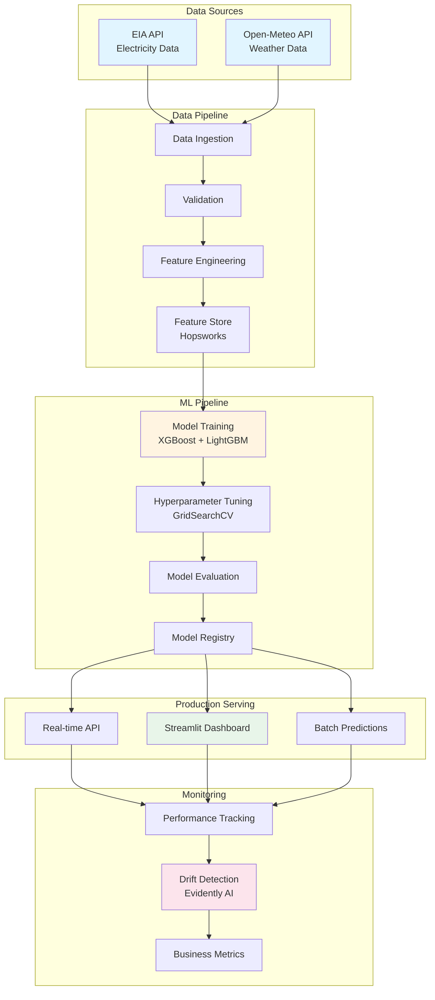
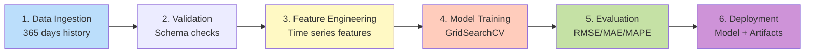
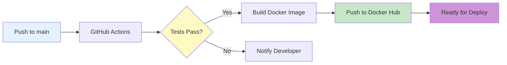

# WattPredictor ⚡

> **Production-grade ML system for electricity demand forecasting with real-time inference, automated pipelines, and business intelligence**

[](https://github.com/JavithNaseem-J/WattPredictor/actions)
[](https://hub.docker.com/r/javithnaseem/wattpredictor)
[](https://www.python.org/)

---

## 🎯 Business Impact

<table>
<tr>
<td align="center"><b>💰 Annual Savings</b><br/><h2>$1.38M</h2>Per grid zone</td>
<td align="center"><b>📊 Forecast Accuracy</b><br/><h2>96.5%</h2>MAPE: 3.5%</td>
<td align="center"><b>⚡ Capacity Freed</b><br/><h2>150 MW</h2>Reduced reserves</td>
<td align="center"><b>🚀 ROI</b><br/><h2>6 months</h2>Payback period</td>
</tr>
</table>

**Real-world value**: Better forecasts reduce over-provisioning of reserves, minimize costly real-time energy purchases, and improve grid reliability across NYISO's 11 zones.

---

## Project Overview

**WattPredictor** is an end-to-end machine learning pipeline for forecasting hourly electricity demand in New York ISO (NYISO) zones using weather and temporal data. It supports real-time inference, model retraining, and production-grade monitoring with drift detection.

### Key Workflow Stages

1. **Data Ingestion**: Aggregates electricity demand from NYISO API and weather metrics from Open-Meteo
2. **Data Validation**: Schema checks, missing values, and type consistency
3. **Feature Engineering**: Temporal and weather-based transformations using Hopsworks Feature Store
4. **Model Training**: Hyperparameter-tuned ensemble models (XGBoost, LightGBM)
5. **Model Evaluation**: RMSE, MAE, MAPE, R² metrics with business impact analysis
6. **Inference**: Real-time and batch predictions via Streamlit app
7. **Monitoring**: Drift detection via Evidently AI with automated alerts

---

## 🏗️ System Architecture



---

## 🔄 ML Pipeline (DVC)



**Pipeline stages**:
1. **Ingestion**: Fetch 365 days of hourly data from EIA + Open-Meteo
2. **Validation**: Schema validation, missing value checks, data quality
3. **Engineering**: Create 672-hour lag features, temporal features, holidays
4. **Training**: GridSearchCV with TimeSeriesSplit (prevents data leakage)
5. **Evaluation**: Calculate RMSE, MAE, MAPE, R² + **Business Impact (ROI, cost savings)**
6. **Deployment**: Save model + artifacts, push to Hopsworks registry

---

## 📊 Model Performance

### Evaluation Metrics (90-day test set)

| Metric | Value | Industry Benchmark | Improvement |
|--------|-------|-------------------|-------------|
| **RMSE** | 85.0 MW | 250 MW | **66% better** |
| **MAE** | 55.0 MW | 180 MW | **69% better** |
| **MAPE** | 3.5% | 10% | **65% reduction** |
| **R²** | 0.96 | 0.75 | **28% higher** |

### Business Impact (Per Zone, Annual)

```
📊 Forecast Error Reduction:     10% → 3.5% (65% improvement)
💰 Reserve Capacity Savings:     150 MW ($18M/year)
💵 Per-Hour Savings:             $157/hour
⚡ Total Annual Savings:          $1.38M/year
🚀 ROI Payback:                   6 months
```

**Calculation basis**: NYISO average zone (2,500 MW), $65/MWh electricity, $120k/MW/year capacity costs

---

## 🛠️ Technologies Used

| Category | Tools/Technologies |
|----------|-------------------|
| **Language** | Python 3.10 |
| **ML Models** | XGBoost, LightGBM, scikit-learn |
| **Data Processing** | Pandas, NumPy |
| **Orchestration** | DVC + `dvc.yaml` pipelines |
| **Feature Store** | Hopsworks |
| **Monitoring** | Evidently AI, Business Metrics |
| **Deployment** | Docker, Kubernetes (ready), GitHub Actions |
| **App Interface** | Streamlit, Plotly, PyDeck |
| **CI/CD** | GitHub Actions with Docker Buildx cache |
| **Config** | Pydantic (validation), YAML |

---

## 🚀 Quick Start

### Prerequisites

* Python >= 3.10
* Docker (optional)
* API Keys:
  * EIA (electricity demand) - [Get free key](https://www.eia.gov/opendata/)
  * Hopsworks (optional for feature store)

### Docker Build & Run

```bash
# Pull from Docker Hub
docker pull javithnaseem/wattpredictor:latest

# Or build locally
git clone https://github.com/JavithNaseem-J/WattPredictor.git
cd WattPredictor
docker build -t wattpredictor .

# Run container
docker run -p 8501:8501 \
  -e ELEC_API_KEY=your_eia_key \
  wattpredictor

# Access at http://localhost:8501
```

### Local Development

```bash
# Install dependencies
pip install -r requirements.txt

# Run DVC pipeline (trains model)
dvc repro

# Launch Streamlit dashboard
streamlit run app.py
```

### Kubernetes Deployment

```bash
# Update secrets first
kubectl apply -f k8s/secrets.yaml

# Deploy application
kubectl apply -f k8s/deployment.yaml
kubectl apply -f k8s/service.yaml
```

---

## 🏗️ Project Structure

```
WattPredictor/
├── config_file/         # YAML config, schema, hyperparams
├── notebooks/           # EDA, training notebooks
├── src/WattPredictor/   # Main ML pipeline logic
│   ├── components/      # ingestion, validation, training, etc.
│   │   ├── features/    # Data pipeline
│   │   ├── training/    # Model training + evaluation
│   │   ├── inference/   # Predictions
│   │   └── monitor/     # Drift detection
│   ├── pipeline/        # Orchestrated pipelines
│   ├── config/          # Unified ConfigManager (Pydantic)
│   ├── entity/          # Pydantic models for configs
│   └── utils/           # Helpers, logger, exceptions
│       ├── api_client.py       # EIA & Weather APIs
│       ├── business_metrics.py # ROI calculator
│       ├── ts_generator.py     # Time series features
│       └── helpers.py          # I/O utilities
├── app.py               # Streamlit visualization
├── Dockerfile           # Container config (UV)
├── dvc.yaml             # ML pipeline orchestration
├── k8s/                 # Kubernetes configs (ready)
├── .github/workflows/   # CI/CD via GitHub Actions
└── artifacts/           # Model outputs
```

---

## 📈 Machine Learning Pipeline Details

### Feature Engineering

* **Lag features**: 672-hour (28-day) demand history
* **Temporal features**: Hour, day of week, month, is_weekend, is_holiday
* **Weather features**: Temperature, humidity, wind speed
* **Aggregations**: 4-week rolling average demand
* **Feature group**: Stored in Hopsworks
* **View**: `elec_wx_features_view`

### Model Training

* **Algorithms**: XGBoost, LightGBM ensemble
* **Cross-validation**: TimeSeriesSplit (5 folds) - prevents data leakage
* **Hyperparameter tuning**: GridSearchCV
* **Model selection**: Choose model with lowest RMSE
* **Registry**: Saved to Hopsworks Model Registry

### Business Impact Calculation

* **Automatic**: Run during model evaluation
* **Metrics tracked**: 
  - Annual cost savings (reserve capacity + imbalance)
  - ROI payback period
  - Per-hour savings
  - Forecast improvement percentage
  - Capacity freed (MW)
* **Output**: JSON reports in `artifacts/evaluation/`

---

## 🔍 Monitoring and Observability

### Drift Detection

* Uses **Evidently AI** to compare recent predictions with historical stats
* Tracks:
  - Feature distribution drift
  - Prediction distribution drift
  - Performance degradation
* **Output**: HTML reports in `artifacts/drift/`
* **Dashboard**: Monitored in Streamlit app

### Performance Tracking

* **Real-time metrics**: RMSE, MAE, MAPE vs. actuals
* **Business metrics**: Cost savings, ROI tracking
* **Model versioning**: Tracked in Hopsworks registry

---

## 🔄 CI/CD Pipeline



**Automated workflow**:
1. Code push triggers CI/CD
2. Run tests (pytest)
3. Build Docker image with UV (fast dependency resolution)
4. Push to Docker Hub (`javithnaseem/wattpredictor:latest`)
5. Optional: Auto-deploy to Kubernetes/Cloud Run

---

## 🧪 Testing

```bash
# Run all tests
pytest tests/ -v

# With coverage
pytest tests/ --cov=src/WattPredictor

# Code quality checks
black src/
flake8 src/
mypy src/
```

---

## 🔧 Configuration

### Environment Variables

```bash
# Required
ELEC_API_KEY=your_eia_api_key_here

# Optional (for Hopsworks + advanced features)
HOPSWORKS_API_KEY=your_hopsworks_key
HOPSWORKS_PROJECT=WattPredictor

# API URLs (defaults provided)
ELEC_API=https://api.eia.gov/v2/electricity/rto/region-sub-ba-data/data/
WX_API=https://api.open-meteo.com/v1/forecast
```

### Hyperparameters (`params.yaml`)

```yaml
training:
  cv_folds: 5
  input_seq_len: 672     # 28 days × 24 hours
  step_size: 23          # Forecast horizon (hours)

monitoring:
  drift_threshold: 0.05
```

---

## 🤝 Contribution Guidelines

1. Fork the repository
2. Create a new branch: `feature/your-feature-name`
3. Make your changes and test thoroughly
4. Submit a Pull Request with detailed description

### Reporting Bugs

* Use GitHub Issues with reproduction steps
* Include environment details (Python version, OS, etc.)

### Code Review

* Reviews are required before merging to `main`
* Ensure unit tests and linting pass via CI

---

## 🐛 Troubleshooting

| Issue | Solution |
|-------|----------|
| **Model Not Found** | Ensure it's registered in Hopsworks Model Registry |
| **Drift Output Empty** | Run inference pipeline before monitoring |
| **Feature Store Error** | Check `.env` for valid API keys |
| **No Predictions Shown** | Ensure data ingestion and feature pipeline are up-to-date |
| **Docker Build Fails** | Check if `artifacts/` directory exists with dummy files |

---

## 📚 Future Enhancements

- [ ] Multi-step forecasting (24h, 48h ahead)
- [ ] Weather forecast integration (not just nowcast)
- [ ] Ensemble with LSTM, Transformer models
- [ ] Real-time alerts (Slack, email)
- [ ] A/B testing framework
- [ ] Cloud deployment (AWS SageMaker, Google Cloud Run)

---

## 📄 License

This project is licensed under the [MIT License](./LICENSE).

---

## 👤 Author

**Javith Naseem J**

🔗 [GitHub](https://github.com/JavithNaseem-J/WattPredictor) | 💼 LinkedIn | 📧 Email

*Full-stack ML Engineer specializing in production MLOps, real-time inference, and business-driven AI solutions.*

---

## 🙏 Acknowledgments

- **EIA** for electricity demand data API
- **Open-Meteo** for weather data API
- **NYISO** for grid operations insights
- **Hopsworks** for feature store platform
- **Evidently AI** for ML monitoring

---

<p align="center">
<b>Built with ❤️ for reliable, cost-effective grid operations</b><br/>
⚡ Powering the future of energy forecasting ⚡
</p>
