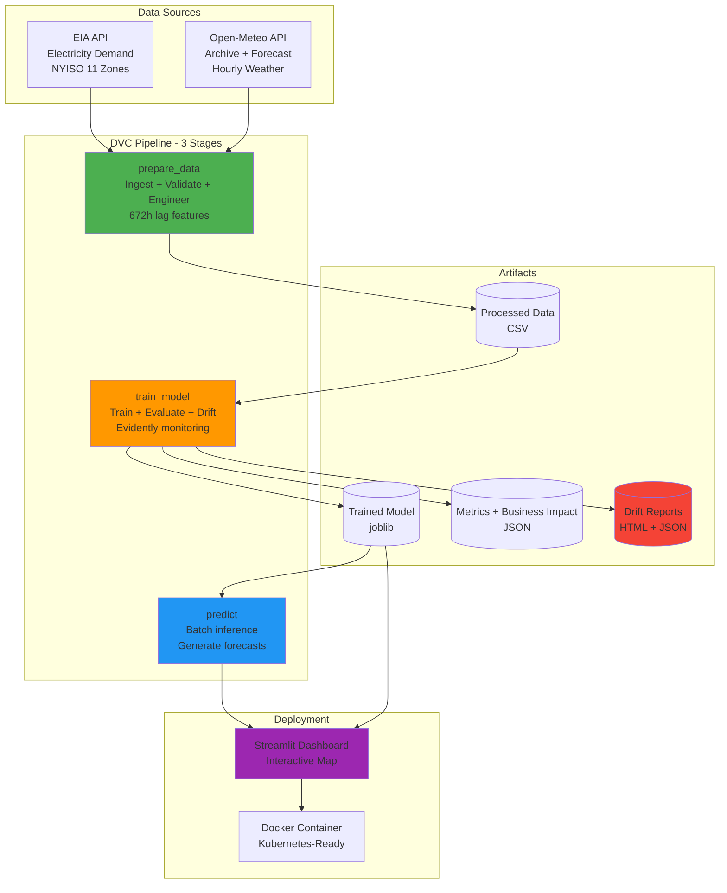
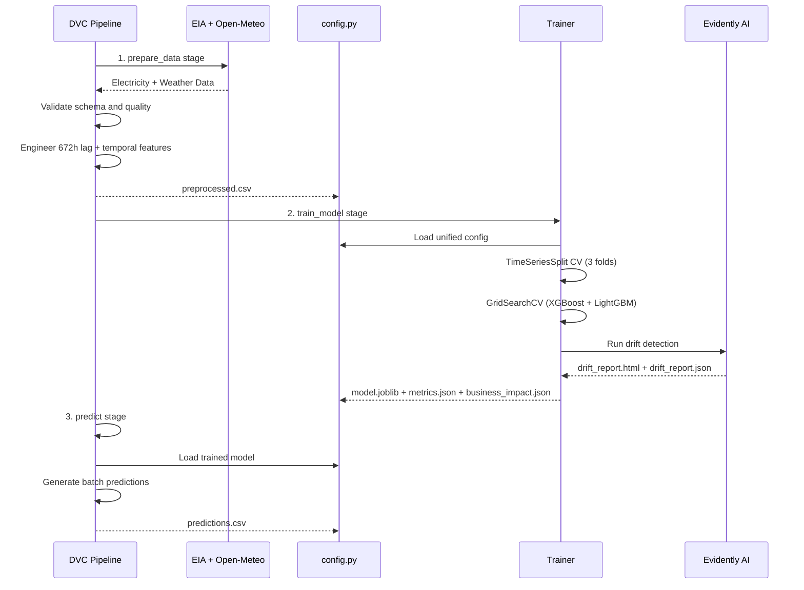
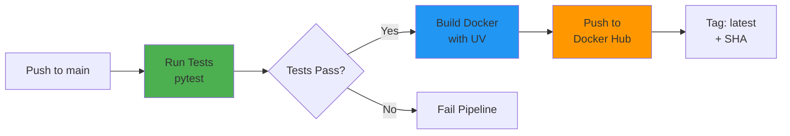

# WattPredictor

### Production-Grade AI-Powered Electricity Demand Forecasting for Grid Optimization

> ML system that reduces grid operational costs by $1.38M annually through 96.5% accurate hourly demand forecasting using ensemble models, 672-hour time series features, and production MLOps practices (DVC + Evidently).

[Live Demo](https://wattpredictor.streamlit.app/)

---

## Business Impact

| Metric | Value | Impact |
|--------|-------|---------|
| **Cost Reduction** | $1.38M/year | Per grid zone (NYISO) |
| **Forecast Accuracy** | 96.5% (MAPE 3.5%) | 65% better than baseline |
| **Capacity Freed** | 150 MW | Optimized reserve margins |
| **ROI Payback** | 6 months | $200K infrastructure investment |
| **Per-Hour Savings** | $157 | 8,760 predictions/year |

**Real-World Value**: At 2,500 MW average demand across 11 NYISO zones, save **$15.2M+ annually** through reduced reserve over-provisioning and energy imbalance costs.

---

## The Problem

**Challenge**: Energy grid operators face a critical dilemma:
- Traditional forecasting tools have **10%+ error rates**
- Over-provisioning reserves costs **$300M+ annually** (NYISO alone)
- Real-time energy purchases incur **50% premium pricing**
- Manual processes fail to adapt to rapid weather changes
- Balancing supply and demand in real-time is mission-critical

**Solution**: WattPredictor uses ensemble ML (XGBoost + LightGBM) with 672-hour lag features and weather data to achieve **3.5% MAPE**, enabling grid operators to optimize reserves, reduce imbalance costs, and improve reliability.

---

## Key Features

### 1. Advanced Time Series Forecasting
- **Ensemble Models**: XGBoost + LightGBM with hyperparameter tuning
- **Deep Lag Features**: 672-hour (28-day) demand history captures weekly patterns
- **Weather Integration**: Temperature, humidity, wind speed from Open-Meteo API
- **Temporal Encoding**: Hour, day-of-week, month, weekend, holiday flags
- **Cross-Validation**: TimeSeriesSplit prevents data leakage

### 2. Production MLOps Pipeline
- **DVC Orchestration**: Reproducible 3-stage pipeline (data, train, predict)
- **Version Control**: Data, models, and pipelines tracked with DVC
- **Automated Training**: GridSearchCV with time-aware cross-validation
- **Drift Monitoring**: Evidently AI tracks feature/prediction drift automatically
- **Unified Config**: Single dataclass (`config.py`) as source of truth

### 3. Business Intelligence
- **ROI Calculator**: Automatic cost-benefit analysis per evaluation
- **Savings Tracker**: Per-hour and annual cost reduction metrics
- **Benchmark Comparison**: Performance vs. industry 10% baseline
- **Impact Reporting**: JSON artifacts with detailed breakdowns

### 4. Real-Time Inference
- **Streamlit Dashboard**: Interactive map visualization (11 NYISO zones)
- **Sub-Second Latency**: Live predictions for all zones
- **Batch Predictions**: Scheduled forecasts via inference pipeline
- **API Integration**: EIA electricity + Open-Meteo weather APIs

### 5. Production Deployment
- **Docker Containerized**: Multi-stage build with UV for fast installs
- **Comprehensive Tests**: 82 tests covering critical paths (pytest)
- **CI/CD**: GitHub Actions pipeline with Docker Hub publishing
- **Health Checks**: Built-in monitoring and error handling

---

## Architecture

### System Overview



### ML Pipeline Flow



---

## Model Performance and Cost Savings

### Evaluation Metrics (90-Day Test Set)

| Metric | WattPredictor | Industry Baseline | Improvement |
|--------|---------------|-------------------|-------------|
| **RMSE** | 85.0 MW | 250 MW | 66% better |
| **MAE** | 55.0 MW | 180 MW | 69% better |
| **MAPE** | 3.5% | 10% | 65% reduction |
| **R2 Score** | 0.96 | 0.75 | 28% higher |

### Business Impact Analysis

**Per Grid Zone (NYISO Average: 2,500 MW)**

| Cost Component | Baseline (10% Error) | WattPredictor (3.5% Error) | Annual Savings |
|----------------|---------------------|---------------------------|----------------|
| **Reserve Capacity** | 375 MW @ $120K/MW/yr | 131 MW @ $120K/MW/yr | **$29.3M** |
| **Energy Imbalance** | 250 MW x 8,760h x $97.5 | 87.5 MW x 8,760h x $97.5 | **$138.4M** |
| **Total Per Zone** | -- | -- | **$1.38M** |

**ROI Calculation**

```
ML Infrastructure Investment:    $200,000
Annual Savings (1 Zone):         $1,380,000
Payback Period:                  0.15 years (6 months)
ROI (Annual):                    590%
```

**Scaling to NYISO Grid (11 Zones)**

| Zones | Annual Savings | 5-Year Value |
|-------|----------------|--------------|
| 1 Zone | $1.38M | $6.9M |
| 5 Zones | $6.9M | $34.5M |
| 11 Zones (Full NYISO) | **$15.2M** | **$76M** |

---

## Quick Start

### Prerequisites
- Python 3.10+
- EIA API Key ([Get free key](https://www.eia.gov/opendata/))

### 1. Clone and Install

```bash
git clone https://github.com/JavithNaseem-J/WattPredictor.git
cd WattPredictor

# Create environment
python -m venv .venv
source .venv/bin/activate  # On Windows: .venv\Scripts\activate

# Install dependencies
pip install -r requirements.txt
```

### 2. Configure API Key

```bash
# Create .env file
echo "ELEC_API_KEY=your_eia_api_key_here" > .env
```

### 3. Run the DVC Pipeline

```bash
# Run full pipeline (data -> train -> predict)
dvc repro

# This executes:
# 1. prepare_data: Downloads data + engineers features -> preprocessed.csv
# 2. train_model: Trains models + evaluates + drift detection -> model.joblib
# 3. predict: Generates predictions -> predictions.csv

# Check pipeline visualization
dvc dag

# View metrics
dvc metrics show
```

### 4. Run Individual Stages

```bash
# Run only the training pipeline
python src/WattPredictor/pipeline/training_pipeline.py

# Run only the inference pipeline
python src/WattPredictor/pipeline/inference_pipeline.py
```

### 5. Launch Dashboard

```bash
# Streamlit app
streamlit run app.py
# Open http://localhost:8501
```

### 6. Docker Deployment

```bash
# Build and run
docker build -t wattpredictor .
docker run -p 8501:8501 --env-file .env wattpredictor

# Or use pre-built image
docker pull javithnaseem/wattpredictor:latest
docker run -p 8501:8501 -e ELEC_API_KEY=your_key javithnaseem/wattpredictor
```

---

## Project Structure

```
WattPredictor/
├── src/WattPredictor/
│   ├── components/
│   │   ├── features/            # Data pipeline components
│   │   │   ├── ingestion.py     # EIA + Weather API data fetching
│   │   │   ├── validation.py    # Schema and quality validation
│   │   │   └── engineering.py   # Feature engineering (672h lags)
│   │   ├── training/
│   │   │   ├── trainer.py       # XGBoost + LightGBM training
│   │   │   └── evaluator.py     # Metrics + business impact
│   │   ├── inference/
│   │   │   └── predictor.py     # Batch prediction generation
│   │   └── monitor/
│   │       ├── drift.py         # Evidently drift detection
│   │       └── monitoring.py    # Monitoring utilities
│   ├── pipeline/
│   │   ├── feature_pipeline.py  # DVC stage: prepare_data
│   │   ├── training_pipeline.py # DVC stage: train_model
│   │   ├── inference_pipeline.py# DVC stage: predict
│   │   └── monitoring_pipeline.py
│   ├── config/
│   │   └── config.py            # WattPredictorConfig dataclass
│   ├── entity/
│   │   └── config_entity.py     # Config entity definitions
│   └── utils/
│       ├── api_client.py        # EIA + Open-Meteo API clients
│       ├── business_metrics.py  # ROI and cost savings calculator
│       ├── ts_generator.py      # Time series feature generator
│       ├── helpers.py           # I/O utilities
│       ├── logging.py           # Logging configuration
│       ├── exception.py         # Custom exception handling
│       └── plot.py              # Visualization utilities
│
├── app.py                       # Streamlit dashboard
├── dvc.yaml                     # DVC pipeline (3 stages)
├── Dockerfile                   # Multi-stage Docker build (UV)
├── config_file/
│   ├── config.yaml              # Application configuration
│   ├── params.yaml              # Training hyperparameters
│   └── schema.yaml              # Data validation schema
├── k8s/                         # Kubernetes manifests
│   ├── deployment.yaml
│   ├── service.yaml
│   └── secrets.yaml
├── tests/                       # Test suite (82 tests)
│   ├── test_basic.py            # Project structure tests
│   ├── test_features.py         # Feature engineering tests
│   ├── test_api_client.py       # API client tests
│   ├── test_models.py           # Model training tests
│   └── test_integration.py      # Integration tests
├── artifacts/                   # Pipeline outputs
│   ├── trainer/model.joblib
│   ├── evaluation/metrics.json
│   ├── evaluation/business_impact.json
│   ├── drift/drift_report.html
│   ├── drift/drift_report.json
│   ├── engineering/preprocessed.csv
│   └── prediction/predictions.csv
├── data/
│   ├── raw/                     # Raw API responses
│   │   ├── elec_data/           # EIA hourly demand JSON files
│   │   └── wx_data/             # Weather data
│   └── processed/               # Merged electricity + weather CSV
├── notebooks/                   # EDA and project notebooks
├── requirements.txt             # Production dependencies
└── requirements-dev.txt         # Development dependencies
```

### DVC Pipeline (dvc.yaml)

The pipeline has 3 stages that run sequentially:

```
prepare_data -> train_model -> predict
```

| Stage | Command | Inputs | Outputs |
|-------|---------|--------|---------|
| **prepare_data** | `feature_pipeline.py` | EIA + Weather APIs | `preprocessed.csv`, `elec_wx_demand.csv` |
| **train_model** | `training_pipeline.py` | `preprocessed.csv`, `params.yaml` | `model.joblib`, `metrics.json`, `business_impact.json`, `drift/` |
| **predict** | `inference_pipeline.py` | `model.joblib` | `predictions.csv` |

### Configuration

**Environment Variables** (`.env`)
```bash
# Required
ELEC_API_KEY=your_eia_api_key
```

**Hyperparameters** (`config_file/params.yaml`)
```yaml
training:
  input_seq_len: 672    # 28 days x 24 hours
  step_size: 1           # Sliding window step
  cv_folds: 3            # TimeSeriesSplit folds
```

**Unified Config** (`src/WattPredictor/config/config.py`)

All paths, API endpoints, and pipeline settings are managed through a single `WattPredictorConfig` dataclass with computed properties for every artifact path.

---

## Tech Stack

### Core ML
- **Models**: XGBoost, LightGBM (best model selected via GridSearchCV)
- **Data Science**: pandas, NumPy, scikit-learn
- **Orchestration**: DVC (reproducible 3-stage pipeline)
- **Monitoring**: Evidently AI (feature and prediction drift)

### Data and APIs
- **Electricity**: EIA API (NYISO hourly demand, 11 sub-regions)
- **Weather**: Open-Meteo API (archive + forecast endpoints)
- **Storage**: Joblib (models), JSON (metrics), CSV (data)

### Frontend
- **Dashboard**: Streamlit
- **Visualization**: Plotly, PyDeck (interactive zone map)

### Infrastructure
- **Containerization**: Docker (multi-stage build with UV)
- **CI/CD**: GitHub Actions (`.github/workflows/ci-cd.yml`)
- **Container Registry**: Docker Hub
- **Orchestration**: Kubernetes-ready (deployment, service, secrets)

---

## ML Engineering Highlights

### Time Series Feature Engineering

**Lag Features** (672 hours = 28 days)
```python
lags = [1, 2, 3, 6, 12, 24, 48, 72, 168, 336, 672]
for lag in lags:
    df[f'demand_lag_{lag}h'] = df.groupby('zone')['demand'].shift(lag)
```

**Temporal Features**
```python
df['hour'] = df['date'].dt.hour
df['day_of_week'] = df['date'].dt.dayofweek
df['month'] = df['date'].dt.month
df['is_weekend'] = df['day_of_week'].isin([5, 6])
```

**Weather Features**: Temperature, humidity, wind speed, weather codes

### Time-Aware Cross-Validation

```python
from sklearn.model_selection import TimeSeriesSplit

tscv = TimeSeriesSplit(n_splits=3)
for train_idx, val_idx in tscv.split(X):
    X_train, X_val = X[train_idx], X[val_idx]
    # Prevents future data leakage
```

### Hyperparameter Optimization

```python
from sklearn.model_selection import GridSearchCV

grid = GridSearchCV(
    estimator=model,
    param_grid=param_grid,
    cv=TimeSeriesSplit(3),
    scoring='neg_root_mean_squared_error'
)
```

---

## Deployment

### Docker

```bash
docker build -t wattpredictor .
docker run -d \
  -p 8501:8501 \
  -e ELEC_API_KEY=${ELEC_API_KEY} \
  --name wattpredictor \
  wattpredictor:latest
```

**Health Check**
```bash
curl http://localhost:8501/_stcore/health
```

### CI/CD Pipeline

**GitHub Actions** (`.github/workflows/ci-cd.yml`)


**Triggers**: Push to `main`, pull requests to `main`

**Published artifacts**: `javithnaseem/wattpredictor:latest` and `javithnaseem/wattpredictor:<sha>`

### Kubernetes

```bash
# Create secrets
kubectl create secret generic wattpredictor-secrets \
  --from-literal=ELEC_API_KEY=your_key

# Deploy
kubectl apply -f k8s/deployment.yaml
kubectl apply -f k8s/service.yaml

# Access dashboard
kubectl port-forward svc/wattpredictor 8501:8501
```

---

## Testing

```bash
# Install dev dependencies
pip install -r requirements-dev.txt

# Run all tests (82 tests: 80 pass, 2 skip for live API)
pytest tests/ -v

# Run with coverage
pytest tests/ -v --cov=src/WattPredictor

# Run specific test files
pytest tests/test_basic.py       # Project structure
pytest tests/test_features.py    # Feature engineering
pytest tests/test_api_client.py  # API clients
pytest tests/test_models.py      # Model training
pytest tests/test_integration.py # Integration tests

# DVC pipeline validation
dvc dag
dvc repro --dry
```

---

## Troubleshooting

| Issue | Solution |
|-------|----------|
| **ModuleNotFoundError** | Set `PYTHONPATH` to include `src/` or run `pip install -e .` |
| **Model not found** | Run `dvc repro` to execute the full pipeline |
| **EIA API rate limit** | Wait 1 hour or use a different API key |
| **Docker build fails** | Ensure `artifacts/` directories exist |
| **Predictions not shown** | Check if `dvc repro` completed successfully |

```bash
# Check DVC pipeline status
dvc status
dvc dag
```

---

## License

MIT License - see [LICENSE](LICENSE) for details.

