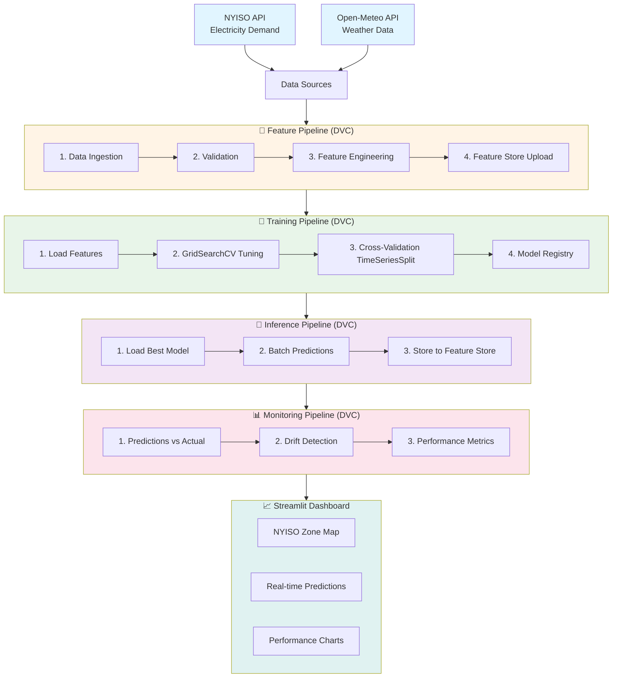
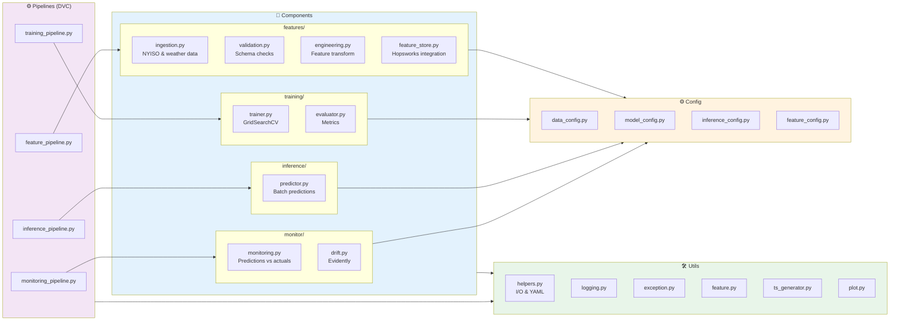
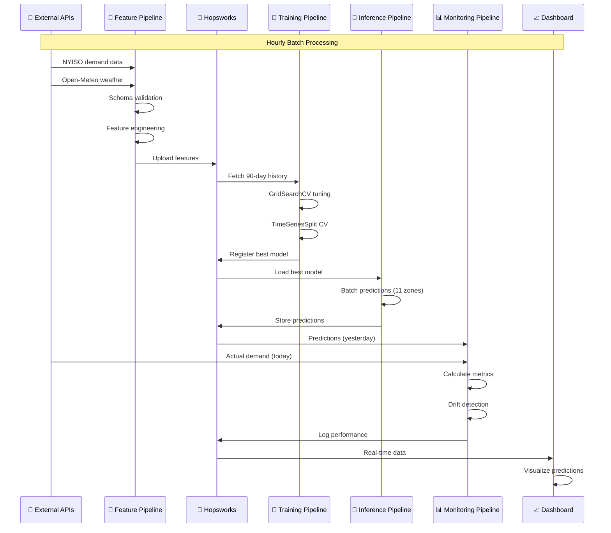
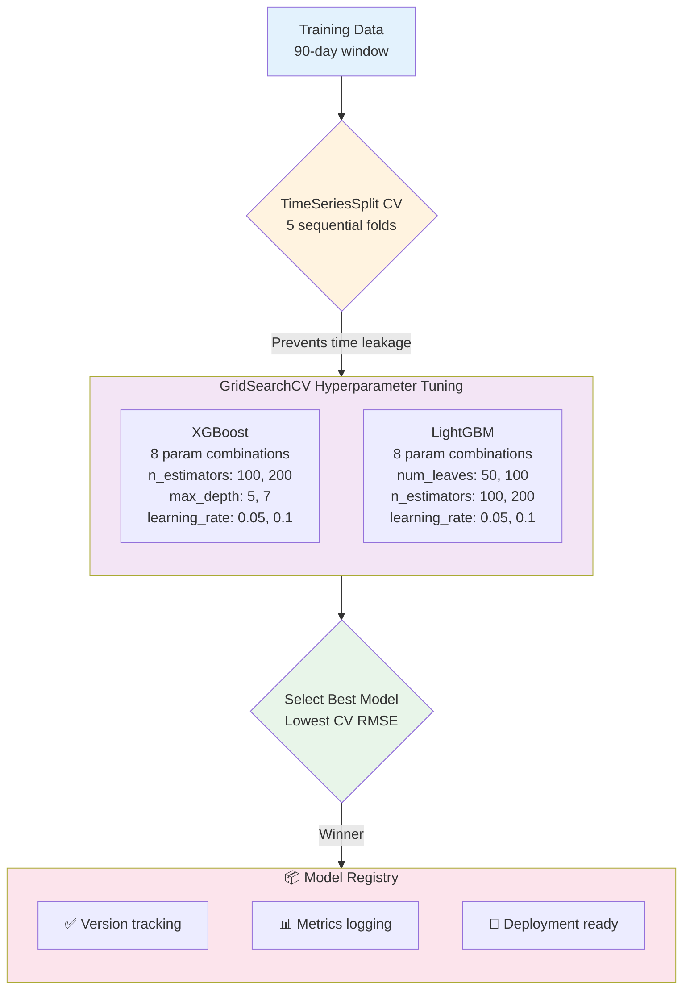

# WattPredictor ⚡

**Production-grade ML pipeline for electricity demand forecasting using weather and temporal data with real-time inference, monitoring, and drift detection.**

---

## 🎯 Overview

WattPredictor is a complete MLOps solution for predicting hourly electricity demand across NYISO (New York ISO) zones. It combines:

- **Data pipeline** with validation and feature engineering
- **Hyperparameter tuning** using GridSearchCV
- **Ensemble models** (XGBoost + LightGBM)
- **Feature store** (Hopsworks) for production serving
- **Monitoring** with drift detection (Evidently)
- **Orchestration** with DVC for reproducibility and automatic caching
- **Deployment** ready for Docker & Kubernetes
- **Dashboard** with Streamlit for real-time predictions

---

## 🏗️ Architecture

### System Architecture



### Component Architecture



### Data Flow



### Model Training Flow



---

## 🛠️ Technologies

| Category | Tools |
|----------|-------|
| **Language** | Python 3.10+ |
| **ML Models** | XGBoost, LightGBM |
| **Tuning** | scikit-learn GridSearchCV |
| **Feature Store** | Hopsworks |
| **Versioning** | DVC |
| **Monitoring** | Evidently |
| **Web App** | Streamlit |
| **Containerization** | Docker |
| **Orchestration** | Kubernetes |
| **Data Sources** | NYISO API, Open-Meteo |

---

## 📋 Prerequisites

- Python 3.10 or higher
- Poetry (package manager)
- DVC (included in dependencies)
- Environment variables for API keys:
  ```
  HOPSWORKS_API_KEY=your_key
  NYISO_API_KEY=your_key
  ```

---

## 🚀 Quick Start

### 1. Installation

```bash
# Clone repository
git clone https://github.com/yourusername/WattPredictor.git
cd WattPredictor

# Install dependencies
poetry install

# Create environment file
cp .env.example .env
# Edit .env and add your API keys
```

### 2. Run Full Pipeline

```bash
# View pipeline structure
dvc dag

# Run entire pipeline with automatic caching
dvc repro

# Run from specific stage onward
dvc repro -s training_pipeline

# Only failing stages are re-executed
# Completed stages use cached results ✅
```

### 3. Run Individual Pipelines

```bash
# Feature engineering and validation
python -m WattPredictor.pipeline.feature_pipeline

# Model training and tuning
python -m WattPredictor.pipeline.training_pipeline

# Batch inference for all zones
python -m WattPredictor.pipeline.inference_pipeline

# Monitoring and drift detection
python -m WattPredictor.pipeline.monitoring_pipeline
```

### 4. Launch Dashboard

```bash
streamlit run app.py
```

Open browser: `http://localhost:8501`

---

## 🐳 Docker & Kubernetes

### Docker

```bash
# Build image
docker build -t wattpredictor:latest .

# Run container
docker run -p 8501:8501 \
  --env-file .env \
  -v $(pwd)/artifacts:/app/artifacts \
  wattpredictor:latest
```

### Kubernetes

```bash
# Deploy all resources
kubectl apply -f k8s/deployment.yaml
kubectl apply -f k8s/service.yaml

# Port forward for local access
kubectl port-forward svc/wattpredictor 8501:8501

# View logs
kubectl logs -f deployment/wattpredictor

# Check pod status
kubectl get pods -l app=wattpredictor
```

---

## 📊 Pipeline Details

### Feature Engineering

**Input**: Raw electricity demand + weather data

**Process**:
- Load NYISO API (hourly demand per zone)
- Fetch Open-Meteo weather (temp, humidity, wind)
- Create temporal features (hour, day of week, month, holidays)
- Schema validation
- Upload to Hopsworks feature store

**Output**: Validated features with 672-hour lookback

### Model Training

**Input**: 90 days of historical features

**Process**:
- GridSearchCV with 8 parameter combos per model
- TimeSeriesSplit (5 folds) - respects temporal order
- Metrics: RMSE, MAE, R²
- Best model registered to Hopsworks

**Output**: Trained model + cross-validation metrics

**Hyperparameters Tuned**:
- **XGBoost**: n_estimators=[100,200], max_depth=[5,7], learning_rate=[0.05,0.1]
- **LightGBM**: num_leaves=[50,100], n_estimators=[100,200], learning_rate=[0.05,0.1]

### Inference

**Input**: Current + historical demand (672 hours)

**Process**:
- Load best model from registry
- Prepare batch features for 11 NYISO zones
- Generate hourly predictions
- Store to feature store

**Output**: Predictions per zone

### Monitoring

**Input**: Yesterday's predictions + today's actuals

**Process**:
- Join with 1-day lag
- Calculate metrics per zone
- Statistical drift detection (Evidently)
- Log performance baseline

**Output**: Monitoring metrics + alerts

---

## 📁 Configuration Files

### `config_file/config.yaml`
Main configuration paths and settings:
```yaml
data:
  root_dir: data
  elec_raw_data: data/raw/elec_data
  wx_raw_data: data/raw/wx_data
  data_file: data/processed/elec_wx_demand.csv

trainer:
  root_dir: artifacts/trainer
  model_name: model.joblib
```

### `config_file/params.yaml`
Hyperparameters and training settings:
```yaml
training:
  cv_folds: 5
  input_seq_len: 672      # 28 days of hourly data
  step_size: 23           # Overlapping window stride
```

### `config_file/schema.yaml`
Data validation schema for feature validation.

---

## 📈 Key Metrics

The best trained model achieves:
- **CV RMSE**: ~5-7% of mean demand
- **Test MAE**: Energy accuracy ±2-3 GWh
- **R² Score**: >0.90

Predictions generated hourly for all 11 NYISO zones.

---

## 🔍 Monitoring & Alerting

**Tracked Metrics**:
- Model predictions vs actual demand
- Temporal data drift
- Feature distribution changes
- Performance degradation

**Alert Thresholds**:
- RMSE increase >15%
- Significant statistical drift
- Missing predictions >6 hours

---

## 💡 DVC Pipeline Caching

The key advantage of using DVC: **automatic caching and resumability**

```bash
# First execution: Runs all 4 stages
dvc repro
# ✅ feature_pipeline [cache miss]
# ✅ training_pipeline [cache miss]
# ✅ inference_pipeline [cache miss]
# ✅ monitoring_pipeline [cache miss]

# Fix bug in monitoring code, re-run
dvc repro
# ⏭️ feature_pipeline [cache hit - skipped]
# ⏭️ training_pipeline [cache hit - skipped]
# ⏭️ inference_pipeline [cache hit - skipped]
# ✅ monitoring_pipeline [cache miss - only this runs]
```

**Benefits**:
- Resume from failure without re-running completed stages
- Automatic input/output tracking via `dvc.yaml`
- Reproducible pipelines across machines
- Fast iteration during development

---

## 📚 Project Structure

```
WattPredictor/
├── app.py                          # Streamlit dashboard
├── dvc.yaml                        # DVC pipeline orchestration
├── Dockerfile                      # Container image
├── pyproject.toml                  # Poetry dependencies
├── LICENSE                         # MIT License
│
├── config_file/                    # YAML configuration
│   ├── config.yaml
│   ├── params.yaml
│   └── schema.yaml
│
├── k8s/                            # Kubernetes manifests
│   ├── deployment.yaml
│   └── service.yaml
│
├── src/WattPredictor/              # Main ML pipeline
│   ├── components/                 # Feature, training, inference, monitoring
│   ├── pipeline/                   # Orchestrated DVC-runnable stages
│   ├── config/                     # Configuration managers
│   ├── entity/                     # Data classes
│   ├── utils/                      # Helpers, logging, exceptions
│   └── constants/                  # Paths and constants
│
├── artifacts/                      # Generated outputs
│   ├── trainer/                    # Models and metrics
│   └── monitor/                    # Drift reports
│
├── data/                           # Data storage
│   ├── raw/                        # Ingested raw data
│   └── processed/                  # Processed features
│
├── logs/                           # Application logs
├── notebooks/                      # EDA and experiments
└── README.md                       # This file
```

---

## 🔄 Usage Examples

### Example 1: Generate Predictions

```python
from WattPredictor.components.inference.predictor import Predictor
from WattPredictor.config.inference_config import InferenceConfigurationManager

config = InferenceConfigurationManager().get_data_prediction_config()
predictor = Predictor(config=config)
predictions_df = predictor.predict(save_to_store=True)
print(predictions_df.head())
```

### Example 2: Access Features from Store

```python
from WattPredictor.utils.feature import feature_store_instance

fs = feature_store_instance()
training_data, _ = fs.get_training_data("elec_wx_features_view")
print(f"Features shape: {training_data.shape}")
print(training_data.head())
```

### Example 3: Check Model Performance

```python
from WattPredictor.components.training.evaluator import Evaluator

evaluator = Evaluator(actual_values, predicted_values)
rmse = evaluator.root_mean_squared_error()
mae = evaluator.mean_absolute_error()
r2 = evaluator.r2_score()

print(f"RMSE: {rmse:.2f}, MAE: {mae:.2f}, R²: {r2:.4f}")
```

---

## 🐛 Troubleshooting

### "Authentication failed for Hopsworks"
```bash
# Verify API key
echo $HOPSWORKS_API_KEY

# Update .env file
nano .env
# Check: HOPSWORKS_API_KEY=your_actual_key
```

### "No predictions found in feature store"
- Ensure feature pipeline completed: `dvc status`
- Check logs: `tail -f logs/running_logs.log`
- Verify API credentials work independently

### "Model training fails with insufficient data"
- Feature pipeline must run first: `dvc repro -s feature_pipeline`
- Need at least 90 days of historical data
- Check feature schema: `cat config_file/schema.yaml`

### "Kubernetes pod stuck in Pending"
```bash
# Check events
kubectl describe pod <pod-name>

# Check resource constraints
kubectl top pods

# View logs
kubectl logs <pod-name> -p
```

---

## 📈 Expected Results

After full pipeline execution:

```
artifacts/
├── trainer/
│   ├── model.joblib                    # Best trained model
│   ├── metrics.csv                     # Cross-validation metrics
│   ├── feature_importance.png          # Feature importance plot
│   └── cv_results.json                 # Detailed CV results
│
└── monitor/
    ├── monitoring_metrics.csv          # Actual vs predicted
    ├── drift_report.html               # Evidently drift report
    └── performance_baseline.json        # Baseline metrics
```

---

## 🤝 Contributing

1. Create feature branch: `git checkout -b feature/your-feature`
2. Make changes and test: `dvc repro`
3. Commit: `git commit -m "Add feature description"`
4. Push: `git push origin feature/your-feature`
5. Open Pull Request

---

## 📝 License

MIT License - see [LICENSE](LICENSE) file

**Last Updated**: January 2026
**Version**: 1.0.0
**Maintainer**: Javith Naseem J
