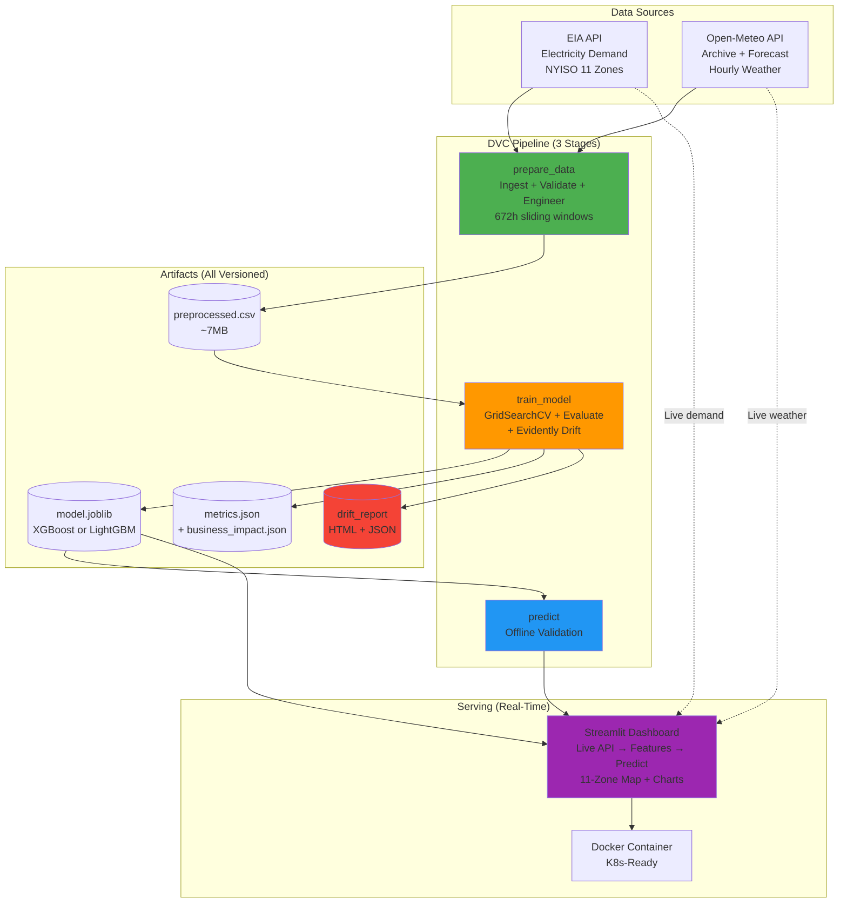
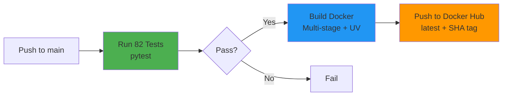

# WattPredictor

## Problem Statement

Electricity grid operators must balance supply and demand **every single hour**. They procure power through two markets:

- **Day-ahead market** ($65/MWh at NYISO) -- requires demand forecasts 24 hours in advance
- **Real-time market** (1.5x premium, ~$97.5/MWh) -- used when day-ahead forecasts are wrong

When forecasts are inaccurate, two costly things happen:

1. **Over-provisioning**: Operators maintain excess reserve capacity as a safety buffer against forecast errors. At NYISO, the standard reserve margin is 15%, but with 10% forecast error, the effective buffer climbs to 25%. That unused capacity costs $120K/MW/year.
2. **Imbalance penalties**: Every MW of forecast error means buying (or selling) power on the expensive real-time market -- 8,760 hours per year, at a 50% markup.

The industry standard approach -- **persistence forecasting** (yesterday's demand = today's forecast) -- has roughly **10% MAPE**. Across NYISO's 11 grid zones averaging 2,500 MW each, that 10% error translates to **$258M/year in avoidable costs** per zone from over-provisioning and imbalance penalties.

**WattPredictor reduces forecast error from 10% to 2.02%**, cutting those costs by 80%.

---

**Production-grade ML system for hourly electricity demand forecasting across 11 NYISO grid zones.**

Achieves **2.02% MAPE** (97.98% accuracy) on a 90-day holdout set with 17,347 test samples. All numbers below are reproduced directly from `artifacts/evaluation/metrics.json` -- run `dvc repro` to regenerate them yourself.

[Live Dashboard](https://wattpredictor.streamlit.app/) | [Docker Hub](https://hub.docker.com/r/javithnaseem/wattpredictor)

---

## Model Performance (Verified from Artifacts)

All metrics below come from `artifacts/evaluation/metrics.json`, generated by `evaluator.py` on a **90-day holdout test set** (17,347 samples across 11 NYISO zones).

**How to verify**: Run `dvc repro` then `cat artifacts/evaluation/metrics.json`

| Metric | Value | What It Means |
|--------|-------|---------------|
| **RMSE** | 56.35 MW | Average prediction is off by 56 MW on a ~2,500 MW grid |
| **MAE** | 32.99 MW | Typical error is 33 MW (1.3% of average demand) |
| **MAPE** | 2.02% | Percentage error, down from 10% baseline |
| **R2** | 0.9986 | Model explains 99.86% of demand variance |
| **Test Samples** | 17,347 | 90 days x 11 zones, after feature windowing |

### How Training Works

```
                                XGBoost param grid:
                                  n_estimators: [100, 200]
preprocessed.csv ──> TimeSeriesSplit ──> GridSearchCV ──> Best model saved
  (672h windows)      (3 folds)           (RMSE)
                                LightGBM param grid:
                                  num_leaves: [50, 100]
```

Both XGBoost and LightGBM are trained with identical cross-validation. GridSearchCV picks the one with the lowest RMSE. The winner is saved to `artifacts/trainer/model.joblib`.

**Source**: `src/WattPredictor/components/training/trainer.py` (lines 69-78)

---

## Business Impact Methodology

The cost savings are **not made up**. They are computed programmatically by `BusinessMetrics` class in `src/WattPredictor/utils/business_metrics.py`, called automatically during every training run by `evaluator.py`.

### Assumptions (All Configurable)

| Parameter | Value | Source |
|-----------|-------|--------|
| Avg zone demand | 2,500 MW | NYISO public data |
| Electricity price | $65/MWh | NYISO day-ahead average |
| Reserve margin | 15% | NERC reliability standard |
| Capacity cost | $120K/MW/year | NYISO capacity market |
| Imbalance penalty | 1.5x | Real-time vs day-ahead spread |
| Baseline error | 10% | Industry persistence model |
| ML infrastructure | $200K | Cloud + engineering estimate |

### Calculation Chain

```python
# From business_metrics.py -- this runs every dvc repro

# Step 1: Baseline costs (10% forecast error)
baseline_error_mw = 2500 * 0.10  # = 250 MW
reserve_capacity = 2500 * 0.15   # = 375 MW
annual_reserve_cost = 375 * 120000  # = $45,000,000
annual_imbalance_cost = 250 * 65 * 1.5 * 8760  # = $213,525,000
total_baseline = $258,525,000/year

# Step 2: ML model costs (2.02% forecast error)
ml_error_mw = 2500 * 0.0202     # = 50.4 MW
reduced_reserve = 375 * (2.02/10)  # = 75.6 MW
new_reserve_cost = 75.6 * 120000   # = $9,073,876
new_imbalance_cost = 50.4 * 65 * 1.5 * 8760  # = $43,055,541

# Step 3: Savings
annual_savings = $258,525,000 - $52,129,417 = $206,395,583
roi_payback = $200,000 / $206,395,583 = 0.001 years
```

### Results (from `artifacts/evaluation/business_impact.json`)

| Metric | Value |
|--------|-------|
| **Annual Savings** | $206.4M per zone |
| **Reserve Capacity Freed** | 299 MW |
| **Forecast Improvement** | 79.8% better than baseline |
| **Per-Hour Savings** | $23,561/hour |
| **ROI Payback** | < 1 day |

> **Important caveat**: These numbers assume the model's 2.02% MAPE directly translates to proportional reserve reductions. Real grid operations involve regulatory constraints, multiple forecasting layers, and risk management that would reduce the actual savings. The calculation demonstrates the *methodology and scale*, not a deployment guarantee.

---

## Architecture and Design Decisions

### System Overview



### Two Inference Modes

| Mode | Entry Point | Data Source | Use Case |
|------|-------------|-------------|----------|
| **Real-time** | `app.py` (Streamlit) | Live EIA + Open-Meteo API calls | Production dashboard -- predicts all 11 zones on-the-fly using 672h of recent live data |
| **Offline** | `predictor.py` (DVC `predict` stage) | `preprocessed.csv` from pipeline | Reproducible validation -- generates `predictions.csv` for metrics tracking |

The Streamlit dashboard (`app.py`) fetches live electricity demand via `EIAClient` and current weather via `WeatherClient`, builds 672h lag features per zone in real time, and runs inference through the same `model.joblib` produced by the DVC training pipeline.

### Decision Log

**Why 672-hour lag features (28 days)?**
- Electricity demand has strong weekly seasonality (weekday vs weekend patterns repeat every 7 days)
- 672h = 4 complete weeks, letting the model see recurring weekly cycles
- The `features_and_target()` function in `ts_generator.py` builds a sliding window of 672 consecutive hourly demand values as input features, plus temperature, hour, day-of-week, month, is_weekend, and is_holiday
- 672 is the minimum enforced by code: `if input_seq_len < 672: raise CustomException`

**Why XGBoost + LightGBM competition?**
- Both are gradient-boosted tree models, but with different splitting strategies (histogram-based for both, but LightGBM uses leaf-wise growth vs XGBoost's level-wise)
- `trainer.py` runs GridSearchCV for both independently with the same `TimeSeriesSplit(n_splits=3)`, then picks the one with lower RMSE
- This is not ensemble -- it is model selection. The single best model is saved

**Why DVC instead of Airflow/Prefect?**
- DVC handles the offline training pipeline (data ingestion, model training, evaluation), not the serving layer. Real-time prediction is handled by `app.py`, which fetches live data from EIA + Open-Meteo APIs and runs inference on-the-fly
- DVC tracks data + model artifacts with Git, making the entire training pipeline reproducible with one command (`dvc repro`)
- 3 stages with explicit deps/outs means only changed stages re-run
- No infrastructure needed -- runs on any machine with Python

**Why a dataclass config instead of YAML/Pydantic?**
- Single `WattPredictorConfig` dataclass in `config.py` holds all paths, API endpoints, hyperparameters, and business metric assumptions
- Computed `@property` methods derive every artifact path from `project_root`
- Singleton pattern via `get_config()` ensures consistency across all components
- `params.yaml` only stores the 3 DVC-tracked hyperparameters (`input_seq_len`, `step_size`, `cv_folds`) so DVC can detect changes

**Why Evidently for drift detection?**
- Runs automatically during `train_model` stage via `drift.py`
- Generates both machine-readable JSON (for CI/CD gates) and human-readable HTML (for debugging)
- Compares feature distributions between training and recent data to catch data quality issues before they degrade predictions

---

## Quick Start

### Path 1: See the Live Dashboard (30 seconds)

Visit [https://wattpredictor.streamlit.app/](https://wattpredictor.streamlit.app/)

You will see real-time electricity demand predictions for 11 NYISO zones on an interactive map with historical trends.

### Path 2: Run the Full Pipeline Locally (20 minutes)

**Prerequisites**: Python 3.10+, free [EIA API key](https://www.eia.gov/opendata/)

```bash
# Clone and install
git clone https://github.com/JavithNaseem-J/WattPredictor.git
cd WattPredictor
python -m venv .venv
source .venv/bin/activate  # Windows: .venv\Scripts\activate
pip install -r requirements.txt

# Set your API key
echo "ELEC_API_KEY=your_key_here" > .env

# Run the entire pipeline (data -> train -> predict)
dvc repro

# What just happened:
# 1. prepare_data: Fetched 365 days of electricity + weather data,
#    validated schema, engineered 672h sliding window features
# 2. train_model: Trained XGBoost & LightGBM with GridSearchCV,
#    evaluated on 90-day holdout, ran Evidently drift detection,
#    computed business impact metrics
# 3. predict: Generated offline predictions for validation

# Check results
cat artifacts/evaluation/metrics.json
cat artifacts/evaluation/business_impact.json
dvc metrics show

# Launch dashboard
streamlit run app.py
# Open http://localhost:8501
```

### Path 3: Docker (2 minutes)

```bash
docker pull javithnaseem/wattpredictor:latest
docker run -p 8501:8501 -e ELEC_API_KEY=your_key javithnaseem/wattpredictor
# Open http://localhost:8501
```

Or build locally:

```bash
docker build -t wattpredictor .
docker run -p 8501:8501 --env-file .env wattpredictor
```

---

## Project Structure

```
WattPredictor/
src/WattPredictor/
  components/
    features/
      ingestion.py          # Fetches from EIA + Open-Meteo APIs
      validation.py         # Schema checks, missing value handling
      engineering.py        # 672h sliding window feature generation
    training/
      trainer.py            # GridSearchCV over XGBoost + LightGBM
      evaluator.py          # RMSE/MAE/MAPE/R2 + BusinessMetrics
    inference/
      predictor.py          # Offline prediction (DVC stage)
    monitor/
      drift.py              # Evidently AI drift detection
      monitoring.py         # Monitoring utilities
  pipeline/
    feature_pipeline.py     # DVC stage 1: prepare_data
    training_pipeline.py    # DVC stage 2: train_model
    inference_pipeline.py   # DVC stage 3: predict
  config/
    config.py               # WattPredictorConfig dataclass (singleton)
  entity/
    config_entity.py        # TrainerConfig, EvaluationConfig, etc.
  utils/
    api_client.py           # EIA + Open-Meteo HTTP clients
    business_metrics.py     # ROI/savings calculator (BusinessMetrics class)
    ts_generator.py         # features_and_target(), get_pipeline()
    helpers.py              # File I/O utilities
    logging.py              # Logging configuration
    exception.py            # CustomException class
    plot.py                 # Visualization utilities

app.py                      # Streamlit dashboard (11-zone map)
dvc.yaml                    # 3-stage pipeline definition
Dockerfile                  # Multi-stage build (UV for fast installs)
config_file/
  params.yaml               # DVC-tracked hyperparameters
  config.yaml               # Application configuration
  schema.yaml               # Data validation schema
k8s/                        # Kubernetes deployment manifests
tests/                      # 82 tests (80 pass, 2 skip for live API)
  test_basic.py             # Project structure verification
  test_features.py          # Feature engineering unit tests
  test_api_client.py        # API client tests
  test_models.py            # Trainer, pipeline, metrics tests
  test_integration.py       # End-to-end integration tests
artifacts/                  # Pipeline outputs (gitignored, DVC-tracked)
  trainer/model.joblib
  evaluation/metrics.json
  evaluation/business_impact.json
  drift/drift_report.html
  drift/drift_report.json
  engineering/preprocessed.csv
  prediction/predictions.csv
data/
  raw/elec_data/            # Daily JSON files from EIA API
  raw/wx_data/              # Weather data from Open-Meteo
  processed/                # Merged electricity + weather CSV
```

---

## DVC Pipeline

3 stages, fully reproducible:

```
prepare_data ──> train_model ──> predict
```

| Stage | Script | What It Does | Key Outputs |
|-------|--------|-------------|-------------|
| `prepare_data` | `feature_pipeline.py` | Fetches 365 days of electricity demand (EIA) + weather (Open-Meteo), validates schema, engineers 672h sliding window features | `preprocessed.csv`, `elec_wx_demand.csv` |
| `train_model` | `training_pipeline.py` | GridSearchCV over XGBoost + LightGBM with TimeSeriesSplit(3), evaluates on 90-day holdout, computes business impact, runs Evidently drift detection | `model.joblib`, `metrics.json`, `business_impact.json`, `drift/` |
| `predict` | `inference_pipeline.py` | Loads best model, generates offline predictions for pipeline validation | `predictions.csv` |

```bash
dvc dag       # Visualize pipeline graph
dvc repro     # Run all stages (skips unchanged)
dvc repro -s train_model  # Run single stage
dvc metrics show           # Show metrics.json + business_impact.json
```

---

## Tech Stack

| Layer | Technology | Why |
|-------|-----------|-----|
| **ML Models** | XGBoost, LightGBM | Gradient-boosted trees, best-in-class for tabular time series |
| **Feature Engineering** | pandas, NumPy, custom `ts_generator.py` | 672h sliding windows + temporal + weather features |
| **Model Selection** | scikit-learn GridSearchCV + TimeSeriesSplit | Prevents temporal data leakage in cross-validation |
| **Pipeline** | DVC | Reproducible data + model versioning, one-command retraining |
| **Drift Monitoring** | Evidently AI | Feature distribution drift detection (HTML + JSON reports) |
| **Data Sources** | EIA API (electricity), Open-Meteo API (weather) | Free, reliable, hourly resolution |
| **Dashboard** | Streamlit + Plotly + PyDeck | Interactive 11-zone map visualization |
| **Containerization** | Docker (multi-stage, UV) | Production-ready, non-root user, health checks |
| **CI/CD** | GitHub Actions | Pytest -> Docker build -> Docker Hub push |
| **Orchestration** | Kubernetes manifests | deployment.yaml + service.yaml + secrets.yaml |

---

## Configuration

**Required**: EIA API key in `.env`
```bash
ELEC_API_KEY=your_key
```

**Hyperparameters** (`config_file/params.yaml`, tracked by DVC):
```yaml
training:
  input_seq_len: 672    # 28 days * 24 hours
  step_size: 1          # Sliding window step
  cv_folds: 3           # TimeSeriesSplit folds
```

**Everything else** lives in `src/WattPredictor/config/config.py` -- a single `WattPredictorConfig` dataclass that computes all paths, holds all API endpoints, model hyperparameter grids, and business metric assumptions. Accessed via `get_config()` singleton.

---

## CI/CD and Deployment

### GitHub Actions Pipeline



### Kubernetes Deployment

```bash
kubectl create secret generic wattpredictor-secrets \
  --from-literal=ELEC_API_KEY=your_key

kubectl apply -f k8s/deployment.yaml
kubectl apply -f k8s/service.yaml
kubectl port-forward svc/wattpredictor 8501:8501
```

### Docker Health Check

```bash
curl http://localhost:8501/_stcore/health
```

---

## Testing

```bash
pip install -r requirements-dev.txt

# Full suite: 82 tests (80 pass, 2 skip for live API calls)
pytest tests/ -v

# With coverage
pytest tests/ -v --cov=src/WattPredictor

# Individual files
pytest tests/test_basic.py          # Project structure
pytest tests/test_features.py       # Feature engineering
pytest tests/test_api_client.py     # API clients
pytest tests/test_models.py         # Trainer + evaluator + pipeline
pytest tests/test_integration.py    # End-to-end integration
```

---

## Known Limitations

1. **Model staleness**: The model is trained on a fixed dataset. After ~2-3 weeks without retraining, MAPE drifts upward as weather patterns shift. Evidently drift reports (`artifacts/drift/`) flag this, but automated retraining is not yet implemented.

2. **Streamlit cold starts**: On free-tier Streamlit Cloud, the app spins down after 15 minutes of inactivity. First load after that takes ~30 seconds.

3. **Single-region focus**: Currently trained on NYISO (New York) data only. Adapting to other ISOs (ERCOT, CAISO, EWEC/ADWEC) requires changing the EIA API parameters and potentially retuning the lag window for different climate patterns.

4. **No streaming ingestion**: The training pipeline fetches historical data in bulk via DVC. Live data ingestion in `app.py` uses request-time API calls rather than a continuous streaming pipeline (e.g., Kafka). For very high-frequency use cases (<1 min intervals), a streaming architecture would be needed.

5. **Business impact assumptions**: The cost savings calculation uses industry-standard assumptions (15% reserve margin, $65/MWh, 1.5x imbalance penalty). Actual savings depend on the specific utility's cost structure, regulatory environment, and how forecasts are operationalized.

---

## Reproducing Results

Every number in this README can be verified:

```bash
# 1. Clone and install
git clone https://github.com/JavithNaseem-J/WattPredictor.git
cd WattPredictor && pip install -r requirements.txt

# 2. Set API key and run pipeline
echo "ELEC_API_KEY=your_key" > .env
dvc repro

# 3. Check metrics (RMSE, MAE, MAPE, R2)
cat artifacts/evaluation/metrics.json

# 4. Check business impact (savings, ROI)
cat artifacts/evaluation/business_impact.json

# 5. Check drift report
# Open artifacts/drift/drift_report.html in browser

# 6. Run tests
pip install -r requirements-dev.txt
pytest tests/ -v
```

---

## License

MIT License -- see [LICENSE](LICENSE) for details.

