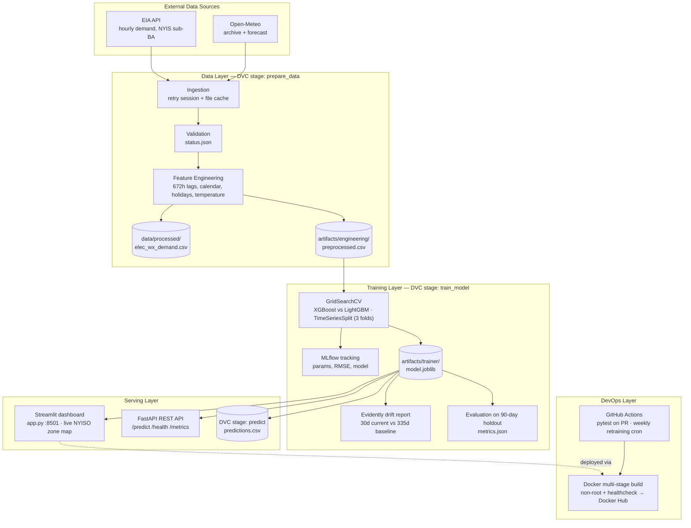
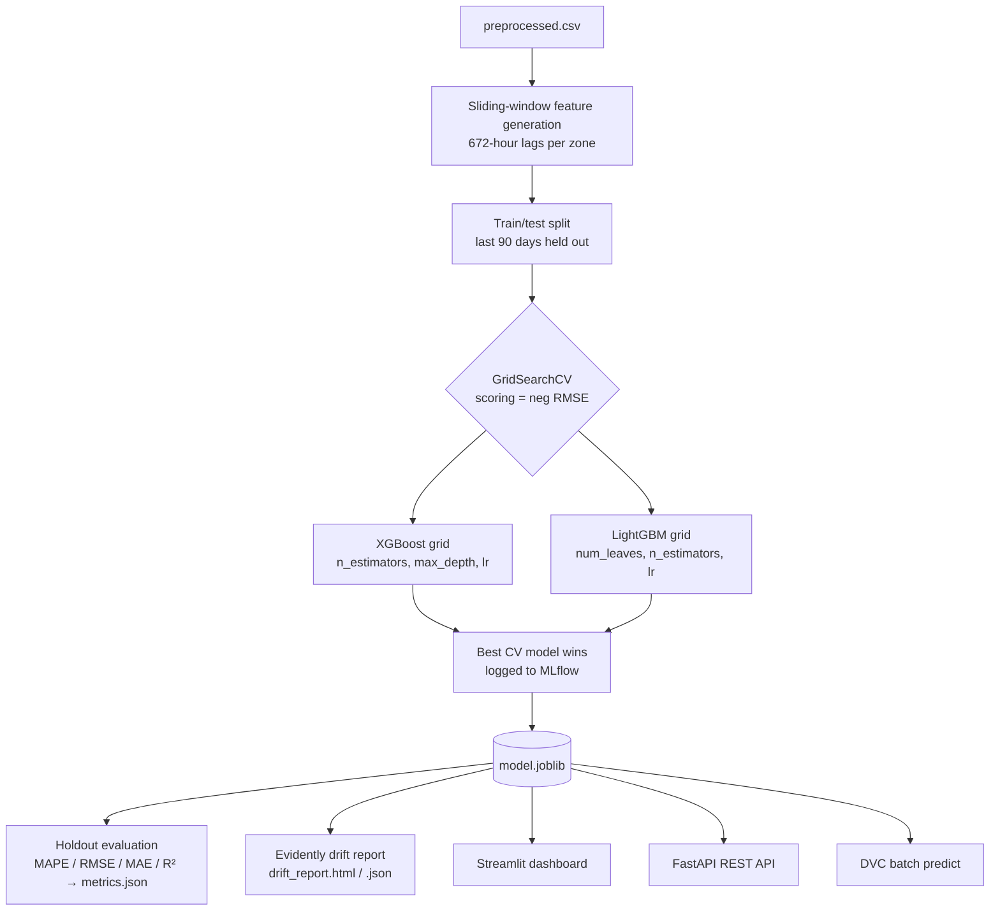

# WattPredictor

Real-time, 1-hour-ahead electricity demand forecasting for all 11 NYISO zones (New York), served as a Streamlit dashboard, a FastAPI REST API, and a Docker image.

## Demo

[SCREENSHOT NOT FOUND — insert demo screenshot of the Streamlit dashboard]

## Problem

Grid operators need accurate short-term demand forecasts per zone to balance supply. WattPredictor predicts next-hour demand (MW) for each of the 11 NYISO sub-regions.

## Features

- **Live data ingestion** — hourly demand from the EIA API (`NYIS` region sub-BA data) + weather from Open-Meteo (archive + forecast endpoints), with file caching and retry sessions
- **Feature pipeline** — 672-hour (4-week) lag windows, calendar features (hour, day-of-week, month, weekend, US federal holidays), temperature, and an engineered `average_demand_last_4_weeks` feature
- **Model selection** — GridSearchCV over XGBoost and LightGBM with `TimeSeriesSplit` (3 folds), tracked in MLflow; winning model: XGBRegressor (`n_estimators=200, max_depth=5, learning_rate=0.1`)
- **Drift monitoring** — Evidently report comparing the last 30 days vs. the prior 335-day baseline (HTML + JSON reports)
- **Three ways to consume** — Streamlit dashboard with a live NYISO zone map, FastAPI endpoints (`POST /predict`, `GET /health`, `GET /metrics`), batch inference via DVC pipeline
- **MLOps** — DVC pipeline (`prepare_data → train_model → predict`), multi-stage Dockerfile (non-root user, healthcheck), GitHub Actions CI with weekly automated retraining (cron `0 0 * * 0`), 78 pytest test functions

## Architecture

### Full System Architecture


```mermaid
flowchart TB
    subgraph SOURCES["External Data Sources"]
        EIA["EIA API<br/>hourly demand, NYIS sub-BA"]
        WX["Open-Meteo<br/>archive + forecast"]
    end

    subgraph DATA["Data Layer — DVC stage: prepare_data"]
        ING["Ingestion<br/>retry session + file cache"]
        VAL["Validation<br/>status.json"]
        FE["Feature Engineering<br/>672h lags, calendar, holidays, temperature"]
        CSV[("data/processed/<br/>elec_wx_demand.csv")]
        PREPROC[("artifacts/engineering/<br/>preprocessed.csv")]
        ING --> VAL
        VAL --> FE
        FE --> CSV
        FE --> PREPROC
    end

    subgraph TRAIN["Training Layer — DVC stage: train_model"]
        GS["GridSearchCV<br/>XGBoost vs LightGBM · TimeSeriesSplit (3 folds)"]
        MLF["MLflow tracking<br/>params, RMSE, model"]
        DRIFT["Evidently drift report<br/>30d current vs 335d baseline"]
        EVAL["Evaluation on 90-day holdout<br/>metrics.json"]
        MODEL[("artifacts/trainer/<br/>model.joblib")]
        GS --> MLF
        GS --> MODEL
        MODEL --> EVAL
        MODEL --> DRIFT
    end

    subgraph SERVE["Serving Layer"]
        ST["Streamlit dashboard<br/>app.py :8501 · live NYISO zone map"]
        API["FastAPI REST API<br/>/predict /health /metrics"]
        PRED[("DVC stage: predict<br/>predictions.csv")]
    end

    subgraph DEVOPS["DevOps Layer"]
        GHA["GitHub Actions<br/>pytest on PR · weekly retraining cron"]
        DOCK["Docker multi-stage build<br/>non-root + healthcheck → Docker Hub"]
    end

    EIA --> ING
    WX --> ING
    PREPROC --> GS
    MODEL --> ST
    MODEL --> API
    MODEL --> PRED
    ST -.->|deployed via| DOCK
    GHA --> DOCK
```

### ML Pipeline Flow (training run)


```mermaid
flowchart TD
    A["preprocessed.csv"] --> B["Sliding-window feature generation<br/>672-hour lags per zone"]
    B --> C["Train/test split<br/>last 90 days held out"]
    C --> D{"GridSearchCV<br/>scoring = neg RMSE"}
    D --> E["XGBoost grid<br/>n_estimators, max_depth, lr"]
    D --> F["LightGBM grid<br/>num_leaves, n_estimators, lr"]
    E --> G["Best CV model wins<br/>logged to MLflow"]
    F --> G
    G --> J[("model.joblib")]
    J --> H["Holdout evaluation<br/>MAPE / RMSE / MAE / R² → metrics.json"]
    J --> I["Evidently drift report<br/>drift_report.html / .json"]
    J --> K["Streamlit dashboard"]
    J --> L["FastAPI REST API"]
    J --> M["DVC batch predict"]
```

## REST API Endpoints

Base: `uvicorn src.WattPredictor.api.main:app` — interactive docs at `/docs`.

| Method | Endpoint | Description | Response |
|---|---|---|---|
| `GET` | `/` | Service status + docs link | `{service, status, documentation}` |
| `GET` | `/health` | Health check — reports whether `model.joblib` is loaded | `{status, model_loaded, model_path, timestamp}` |
| `POST` | `/predict` | Next-hour demand prediction for all 11 NYISO zones | `{status, prediction_time, record_count, predictions: [{sub_region_code, zone_name, predicted_demand_mw, date}]}` |
| `GET` | `/metrics` | Latest evaluation metrics from `artifacts/evaluation/metrics.json` | `{mse, mae, mape, rmse, r2_score}` |

Errors: `/predict` returns `503` if the model artifact is missing, `500` on prediction failure; `/metrics` returns `404` if training hasn't produced metrics yet.

## Tech Stack

Python 3.12 · scikit-learn 1.5.2 · XGBoost 2.1.3 · LightGBM 4.5.0 · MLflow · Evidently 0.4.31 · DVC · FastAPI · Streamlit 1.40.2 · Plotly/PyDeck · Docker · GitHub Actions · uv · pytest

## Results

Held-out test set = last 90 days of the dataset (100,309 hourly rows, 11 zones, 2025-02-17 → 2026-02-17). From `artifacts/evaluation/metrics.json`:

| Metric | Value |
|---|---|
| MAPE | 2.12% |
| RMSE | 59.87 MW |
| MAE | 34.95 MW |
| R² | 0.9984 |

Drift report (`artifacts/drift/drift_report.json`): no dataset-level drift detected (3 of 8 columns drifted, 37.5%).

## Setup & Run

Requires an EIA API key. Set `ELEC_API`, `WX_API`, and `ELEC_API_KEY` in a `.env` file (see `config/config.py` for defaults), then:

```bash
uv sync && uv pip install -e .                          
python src/WattPredictor/pipeline/feature_pipeline.py   
python src/WattPredictor/pipeline/training_pipeline.py  
streamlit run app.py                                    
uvicorn src.WattPredictor.api.main:app --reload         
pytest                                                  
docker build -t wattpredictor . && docker run -p 8501:8501 wattpredictor
```

## Deployment

[DEPLOYMENT LINK NOT FOUND — insert actual URL. CI pushes a Docker image to Docker Hub on every merge to `main` (`.github/workflows/ci-cd.yml`); no live URL is recorded in this repo.]

## Future Work

- Serve the FastAPI app in Docker (current image runs only the Streamlit dashboard)
- Populate the monitoring pipeline (`artifacts/monitoring/monitoring_df.csv` is currently header-only)
- Extend beyond 1-hour-ahead to multi-step horizons

## Keep in Mind

- The app fetches live data and needs a valid `ELEC_API_KEY`; without it, the dashboard stops with an error
- Inference reads `artifacts/engineering/preprocessed.csv`, so run the feature pipeline before predicting
- The 2.12% MAPE reflects the most recent training run committed in `artifacts/`; retraining on newer data will change it

## License

MIT © 2025 Javith Naseem
