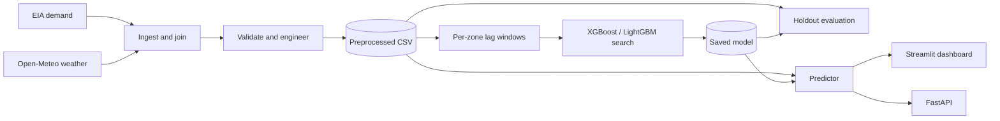

# WattPredictor

Hourly demand forecasts for New York's 11 NYISO zones, built from electricity history and weather data and served through a Streamlit dashboard and FastAPI endpoint.

Python 3.12 · pandas · scikit-learn · XGBoost · LightGBM · Streamlit · FastAPI · MLflow · DVC

## Evidence

[Live dashboard](https://wattpredictor-dashboard.onrender.com/) · [Saved evaluation metrics](artifacts/evaluation/metrics.json)

The saved XGBoost model was scored against the stored preprocessed dataset using the evaluator's last-90-days split and 672-row history window. A read-only recomputation from `model.joblib` and `preprocessed.csv` matched `metrics.json` exactly across **17,292 holdout rows**.

| Holdout metric | Result |
|---|---:|
| MAE | 34.95 MW |
| RMSE | 59.87 MW |
| MAPE | 2.12% |
| R² | 0.99844 |

The scored target timestamps span **16 December 2025 to 17 February 2026**. This is evidence for the saved model on historical data, not a measurement of the hosted dashboard's current forecast accuracy. The holdout includes **682 duplicate zone-hour targets**, and there is no evaluated seasonal-naive baseline.

## Architecture


```mermaid
flowchart LR
    EIA["EIA demand"] --> ING["Ingest and join"]
    WX["Open-Meteo weather"] --> ING
    ING --> FE["Validate and engineer"]
    FE --> CSV[("Preprocessed CSV")]
    CSV --> LAG["Per-zone lag windows"]
    LAG --> SEARCH["XGBoost / LightGBM search"]
    SEARCH --> MODEL[("Saved model")]
    CSV --> EVAL["Holdout evaluation"]
    MODEL --> EVAL
    CSV --> PRED["Predictor"]
    MODEL --> PRED
    PRED --> UI["Streamlit dashboard"]
    PRED --> API["FastAPI"]
```

The feature pipeline joins EIA demand and Open-Meteo weather by UTC timestamp, checks missingness in selected columns, and writes a local CSV. Training forms 672-row demand windows per zone, adds calendar and temperature features, and selects between XGBoost and LightGBM with `GridSearchCV` and `TimeSeriesSplit`. It serializes the selected scikit-learn pipeline and logs tuning metadata to MLflow. A separate post-training step writes an Evidently drift report.

The dashboard, `POST /predict`, and batch inference all call the same `Predictor`. It reads the saved model and preprocessed CSV, prepares one feature row per zone, and writes a predictions CSV. The dashboard also fetches current EIA and weather data for display; those live responses do **not** feed the predictor today.

## Run locally

Requires Python 3.12 and `uv`. The tracked model and preprocessed CSV allow the interfaces to use saved artifacts without a fresh data download.

```bash
uv sync --frozen
uv run streamlit run app.py
uv run uvicorn src.WattPredictor.api.main:app --reload
uv run pytest -o pythonpath=src
```

Run Streamlit and Uvicorn in separate terminals. The dashboard uses `http://localhost:8501`; API documentation uses `http://localhost:8000/docs`. To rebuild data, set `ELEC_API_KEY` and run `uv run python src/WattPredictor/pipeline/feature_pipeline.py`. The training command is `uv run python src/WattPredictor/pipeline/training_pipeline.py`; it runs a multi-model grid search. These setup and run commands were inspected from repository configuration, not executed for this README update.

## Verification

The read-only metric reproduction used the committed preprocessed CSV, saved joblib model, and the feature construction in `src/WattPredictor/utils/ts_generator.py`. It applied the split and metrics from `src/WattPredictor/components/training/evaluator.py`; the recomputed values matched the JSON artifact exactly. No model fitting, API call, or application launch was needed for that check.

Six pytest files cover feature generation, model fit and serialization, mocked API clients, configuration basics, and endpoint response shapes. The full suite was not run during this documentation update. `dvc.yaml` defines data preparation, training, and prediction stages, but its lockfile and one declared output differ from current code and configuration.

## Limits

- **Forecast freshness:** the tracked feature dataset ends in February 2026. Inference caps history at its last row, reuses that row's temperature and calendar fields, and stamps output with the current UTC hour. The dashboard labels the next Eastern hour. A fresh Open-Meteo response is fetched, but it is not passed into inference.
- **Evaluation scope:** offline features include temperature observed at each target hour, whereas serving uses the last stored temperature. The holdout score therefore does not validate the deployed forecast path. The saved CSV contains 4,004 duplicate zone-hour rows, so a 672-row window is not always four weeks. The evaluator's hard-coded 10% comparison is not a measured baseline and is excluded here.
- **Operations:** the weekly GitHub Actions schedule runs tests and an import check; it does not retrain or publish a model. The monitoring CSV has no matched records. `GET /health` checks model-file existence, and the API has no authentication or rate limiting.

## FutureWork

1. Define one forecast timestamp and construct its demand, calendar, and forecast-weather features identically in offline evaluation and serving.
2. Add a time-stamped seasonal-naive baseline and store evaluation metadata alongside model and dataset hashes.
3. Enforce input freshness and feature-schema checks, then wire scheduled retraining to an explicit verified deployment step.

Licensed under the [MIT License](LICENSE).
